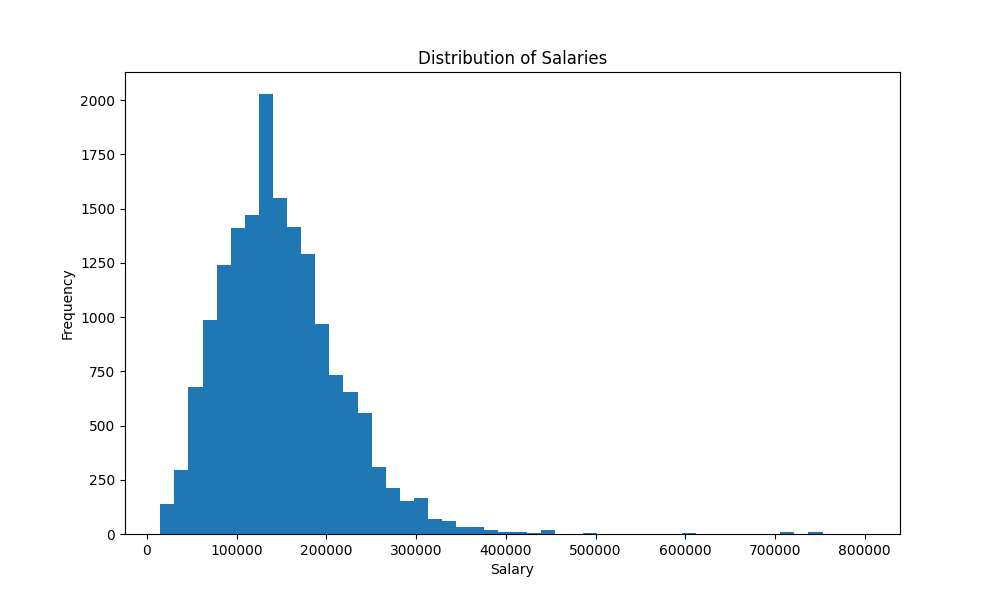
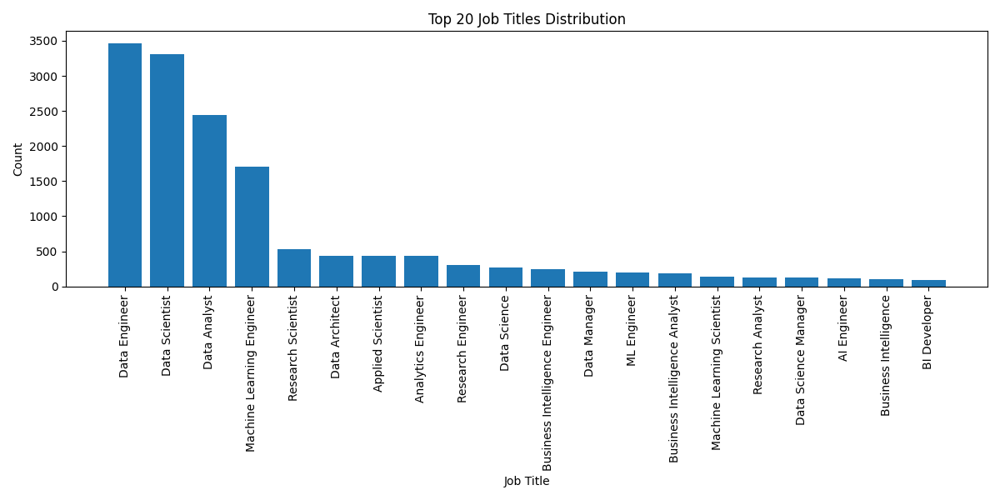
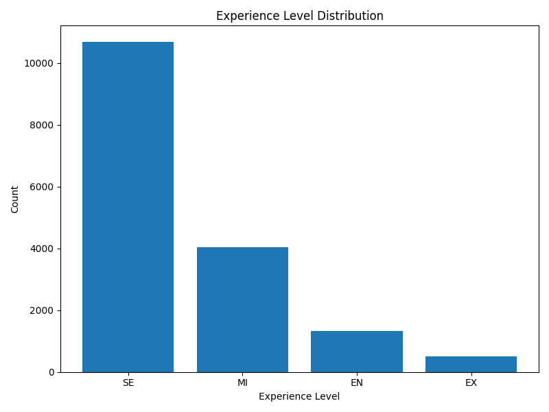
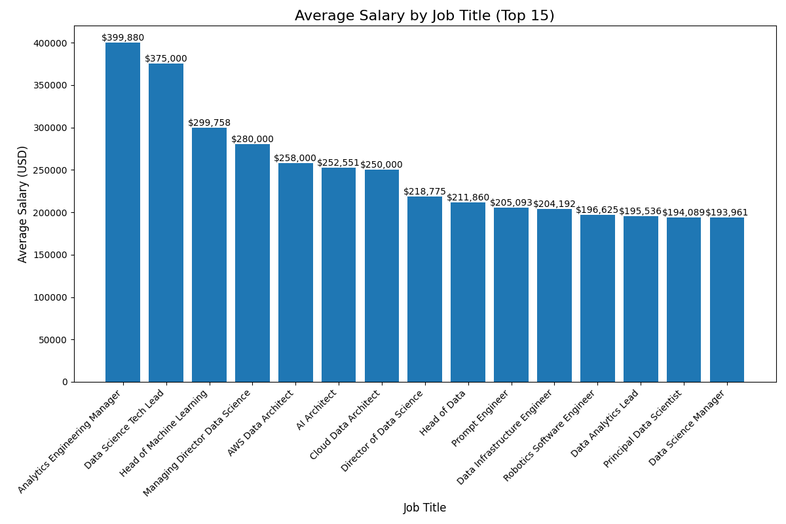

# Evan_Li_IDS706_Hwk14

## Docker Configuration

- The Docker environment is pre-configured. To run the application, first build the Docker image with `make docker-build`, then run the image with `make docker-run`
- The program directory is mounted to the Docker container, so there's no need to rebuild the Docker image after making changes to the program. The generated `analysis_results.md` file will automatically appear in your local directory
- GitHub Actions is configured to automatically push the Docker image to Docker Hub: [bionicotaku/ids706-hwk14](https://hub.docker.com/r/bionicotaku/ids706-hwk14)

## Dataset Overview

The data is sourced from [Kaggle's Data Engineer Salary in 2024 dataset](https://www.kaggle.com/datasets/chopper53/data-engineer-salary-in-2024). This dataset provides insights into data engineer salaries and employment attributes for the year 2024. It includes information such as:

- Salary
- Job title
- Experience level
- Employment type
- Employee residence
- Remote work ratio
- Company location
- Company size

## Project Features

1. Python script using Polars library to read the dataset and generate descriptive statistics with data visualization, finally summarize and create an `analysis_results.md` file. (All Polars library calls, analysis, and plotting are done in the `mylib/calculate_stat.py` file)
2. Creating `test_script.py` to test the script, `test_lib.py` to test the library, and finally using the nbval plugin for pytest to test all files includng ipynb.
3. Used Github Actions to test and run the program and push the analysis file automatically. Generated a badge linked to GitHub actions.

## Data Analysis

You can find the automatically generated Data Analysis file here: [analysis_results](output/analysis_results.md)
Analyzed the following:

- Statistical data and distribution of all salaries
- Job Title Distribution
- Experience Level Distribution
- Average Salary By Job
- Salary Statistics by Experience Level

